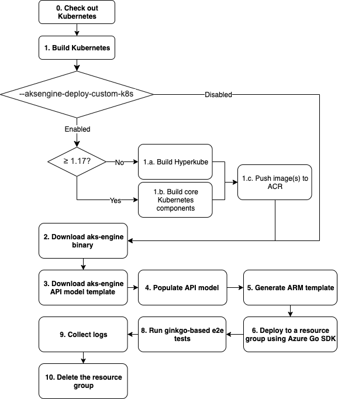

# Upstream Test Infrastructure on Azure

The goal of this document is to describe in detail the process of how we leverage upstream Kubernetes test infrastructure to run presubmit and periodic jobs on Azure clusters.

> Please contact @chewong on GitHub or chuwon@microsoft.com for any questions.

## Table of Contents

  * [Azure Deployer](#azure-deployer)
    + [kubetest](#kubetest)
    + [kubekins-e2e Image](#kubekins-e2e-image)
    + [Lifecycle of Azure deployer](#lifecycle-of-azure-deployer)
    + [Log Collection](#log-collection)
    + [Job Configuration](#job-configuration)
    + [Azure-Specific Job Configuration](#azure-specific-job-configuration)
  * [Testgrid](#testgrid)
  * [Useful Links](#useful-links)

## Azure Deployer

We utilize Azure deployer located in [kubernetes/test-infra](https://github.com/kubernetes/test-infra/blob/master/kubetest/azure.go) to run upstream-related tests that require Azure clusters.

> Currently, we only create clusters using aks-engine.

### kubetest

Azure deployer is part of a binary called `kubetest`, which abstracts the bootstrap logics such as cluster creation/deletion and log collection for different deployers (e.g. Azure, GKE, EKS, etc), as well as wrapping necessary scripts to run upstream Kubernetes e2e tests reliably. To build and test `kubetest` locally, you could execute the following commands:

```bash
git clone https://github.com/kubernetes/test-infra
cd test-infra
CGO_ENABLED=0 GOOS=linux GOARCH=amd64 GO111MODULE=on GOPROXY=https://proxy.golang.org GOSUMDB=sum.golang.org go build -o=./bin/kubetest ./kubetest/
./bin/kubetest --help
```

Here is a list of flags that you should be aware of when using `kubetest`.

| Flag                              | Type     | Description                                                                                                               |
|-----------------------------------|----------|---------------------------------------------------------------------------------------------------------------------------|
| `--test`                          | Boolean  | Set to true if you want to run upstream Kubernetes e2e tests\.                                                            |
| `--up`                            | Boolean  | Set to true if you want to create a cluster before running e2e tests\.                                                    |
| `--down`                          | Boolean  | Set to true if you want to delete a cluster after running e2e tests\.                                                     |
| `--build`                         | String   | Describe how to build Kubernetes\. Set to "quick" when using Azure deployer\.                                             |
| `--provider`                      | String   | Set to 'skeleton' for Azure deployer\.                                                                                    |
| `--deployment`                    | String   | What type of deployer to use\. Set to 'aksengine' if you want to use Azure deployer\.                                     |
| `--aksengine-agentpoolcount`      | Integer  | The number of worker node in an agentpool in the cluster                                                                  |
| `--aksengine-admin-username`      | String   | The username of the cluster's admin                                                                                       |
| `--aksengine-creds`               | String   | The location of Azure credential files\. Set to $\(AZURE_CREDENTIALS\)\.                                                  |
| `--aksengine-orchestratorRelease` | String   | The Kubernetes release to test\.                                                                                          |
| `--aksengine-mastervmsize`        | String   | The size of the master VM\.                                                                                               |
| `--aksengine-agentvmsize`         | String   | The size of the agent VM\.                                                                                                |
| `--aksengine-deploy-custom-k8s`   | Boolean  | Set to true if you want to use custom-built k8s\.                                                                         |
| `--aksengine-location`            | String   | The location of the cluster                                                                                               |
| `--aksengine-public-key`          | String   | The public key of the master VM\.                                                                                         |
| `--aksengine-template-url`        | String   | The API model template to use\.                                                                                           |
| `--aksengine-download-url`        | String   | The URL of aks-engine package tarball                                                                                     |
| `--aksengine-ccm`                 | Boolean  | Set to True if you want kubetest to build a custom cloud controller manager for aks-engine                                |
| `--aksengine-cnm`                 | Boolean  | Set to True if you want kubetest to build a custom cloud node manager for aks-engine\. Require --aksengine-ccm to be true |
| `--aksengine-win-binaries`        | Boolean  | Set to True if you want kubetest to build a custom zip with windows binaries for aks-engine                               |
| `--test_args`                     | String   | Space-separated list of arguments to pass to Ginkgo test runner\.                                                         |
| `--ginkgo-parallel`               | Integer  | The number of runners to run Ginkgo tests in parallel\.                                                                   |
| `--timeout`                       | Duration | Terminate testing after the timeout duration                                                                              |

## Run Kubernetes E2E Tests with `kubetest`

Assuming you have already built a Kubernetes cluster, you could use `kubetest` as a helper to run Kubernetes e2e tests:

```bash
git clone https://github.com/kubernetes/kubernetes $GOPATH/src/k8s.io/kubernetes
cd $GOPATH/src/k8s.io/kubernetes

# Optional: check out a specific release branch
# However, please ensure that your k8s cluster version matches the release branch version
git checkout release-1.xx

# Build necessary components to run e2e tests
make WHAT=test/e2e/e2e.test
make WHAT=cmd/kubectl
make ginkgo

# Necessary environment variables
export KUBECONFIG="Your cluster's KUBECONFIG"
export KUBERNETES_CONFORMANCE_TEST=y

# kubetest can only be executed within $GOPATH/src/k8s.io/kubernetes directory
kubetest \
  --test=true \
  --provider=skeleton \
  --test_args="--ginkgo.focus=... --ginkgo.skip=..." \
  --ginkg-parallel="..." \
  --timeout="..."
```

### kubekins-e2e Image

`kubetest` is then added to an image called **kubekins-e2e**. Whenver a job is triggered, a container is created based on the kubekins-e2e image, where kubetest executes the bootstrap logics and e2e tests. The image is usually updated daily through an automated PR created by k8s-ci-robot ([example](https://github.com/kubernetes/test-infra/pull/15997)). Therefore, changes under `kubetest` are not reflected immediately until the image is updated.

### Lifecycle of Azure Deployer

The flowchart below describes what happens when you execute `kubetest` with `--deployment` set to `aksengine` (assuming `--up`, `--down`, and `--test` are enabled).



0. Check out Kubernetes from https://github.com/kubernetes/kubernetes. You could specify which branch to check out in the job configuration.

1. Build Kubernetes

    if `--aksengine-deploy-custom-k8s` is enabled:

    1.a. for Kubernetes release < 1.17, Azure deployer builds [hyperkube](https://github.com/kubernetes/kubernetes/tree/master/cluster/images/hyperkube#hyperkube). Please refer to [this document](https://github.com/Azure/aks-engine/blob/master/docs/topics/kubernetes-developers.md#kubernetes-116-or-earlier) for more detail.

    1.b. for Kubernetes release >= 1.17, Azure deployer builds core kubernetes images instead ([kube-apiserver](https://kubernetes.io/docs/reference/command-line-tools-reference/kube-apiserver/), [kube-controller-manager](https://kubernetes.io/docs/reference/command-line-tools-reference/kube-controller-manager/), [kube-scheduler](https://kubernetes.io/docs/reference/command-line-tools-reference/kube-scheduler/), [kube-proxy](https://kubernetes.io/docs/reference/command-line-tools-reference/kube-proxy/)). Azure deployer also uploads [kubelet](https://kubernetes.io/docs/reference/command-line-tools-reference/kubelet/) & [kubectl](https://kubernetes.io/docs/reference/kubectl/overview/) as a tarball to Azure blob storage for aks-engine to consume. Please refer to [this document](https://github.com/Azure/aks-engine/blob/master/docs/topics/kubernetes-developers.md#kubernetes-117) for more detail.

    1.c. Push image(s) built from step 1.a or 1.b to an Azure container registry (ACR) so the aks-engine API model can consume it in step 4.

2. Download aks-engine binary specificed in `--aksengine-download-url`.

3. Download aks-engine API model template specificed in `--aksengine-template-url`.

4. Populate aks-engine API model with service principal (SP) credentials and custom images (described in step 1.a and 1.b) if necessary.

5. Generate an ARM template according to the API model using `aks-engine generate`.

6. Deploy the ARM template to a resource group using Azure Go SDK.

7. Run ginkgo-based e2e test extracted from upstream Kubernetes against the Azure cluster created by aks-engine. You can specific `--ginkgo.focus` and `--ginkgo.skip` in `--test_args` to run / skip specific test cases.

8. Collect logs from system-critical pods (described in the next section).

9. Delete the resource group.

### Log Collection

After running e2e tests, we utilize a bash script located in the [cloud-provider-azure](https://github.com/kubernetes-sigs/cloud-provider-azure/tree/master/hack/log-dump) repository to collect logs from system-critical pods so that we can debug test failure easily. The logs are then uploaded to Google Cloud Storage. They can be found when you click on a particular job on [Testgrid](https://testgrid.k8s.io/provider-azure-azuredisk-csi-driver). After that, click 'Artifacts', then 'artifacts' folder to look at logs from each node ([example](https://gcsweb.k8s.io/gcs/kubernetes-jenkins/logs/ci-dualstack-azure-e2e-1-17/1222879675538214913/artifacts/)).

### Job Configuration

To create a presubmit / periodic job, a job configuration must be created within [kubernetes/test-infra](https://github.com/kubernetes/test-infra/blob/master/kubetest/azure.go). To create a basic job configuration, you can check out [this document](https://github.com/kubernetes/test-infra/blob/master/config/jobs/README.md). [pull-cloud-provider-azure-e2e](https://github.com/kubernetes/test-infra/blob/master/config/jobs/kubernetes-sigs/cloud-provider-azure/cloud-provider-azure-config.yaml#L27-L77) is an example of a presubmit job that uses Azure deployer.

> Always refer to existing configurations before creating a new job!

### Azure-Specific Job Configuration

Here are a list of things to do / pay attention to when creating a job configuration that uses Azure deployer:

- Set `preset-azure-cred` to true so that Azure deployer can pick up necessary credentials like service principal and storage account key to run the e2e tests.

- Azure deployer does a lot of overwrites to the API model template, so please pay attention on what to put on your API model template as it might be be reflected in the cluster.

- Set `--build=quick` when executing `kubetest` with `--aksengine-deploy-custom-k8s` enabled.

- `--aksengine-orchestratorRelease` should match the Kubernetes release and the kubekins-e2e image version. For example, if `--aksengine-orchestratorRelease` is set to `1.17`, the job should check out Kubernetes from the `release-1.17` branch and use `gcr.io/k8s-testimages/kubekins-e2e:vxxxxxxxx-xxxxxxx-1.17` kubekins-e2e image.

- Please consider using [Pod Utilities](https://github.com/kubernetes/test-infra/blob/master/prow/pod-utilities.md) when writing new job configurations instead of using the legacy job configuration format. Here is an [example](https://github.com/kubernetes/test-infra/blob/master/config/jobs/kubernetes/sig-cloud-provider/azure/sig-azure-config.yaml#L161-L216) of a job configuration using Pod Utilities.

## Testgrid

Test results are available on [Testgrid](https://testgrid.k8s.io/provider-azure-azuredisk-csi-driver). Each repository that uses Azure deployer are separated by dashboards and within each dashboard, jobs are separated by tabs.

## Useful Links

- [How aks-engine consumes custom-built Kubernetes](https://github.com/Azure/aks-engine/blob/master/docs/topics/kubernetes-developers.md)

- [Ditching Hyperkube](https://gist.github.com/chewong/d39e40bf2dab184c650abac2139c8b23)

- [Slides on test-infra from SIG Testing](https://docs.google.com/presentation/d/1HOQ2df_AT-vIuz-JNaJol2oiGq84m50h9T49_5WgEaI/edit#slide=id.g49782f2733_2_71)

- [SIG Testing Deep Dive](https://www.youtube.com/watch?v=M32NIHRKaOI)
